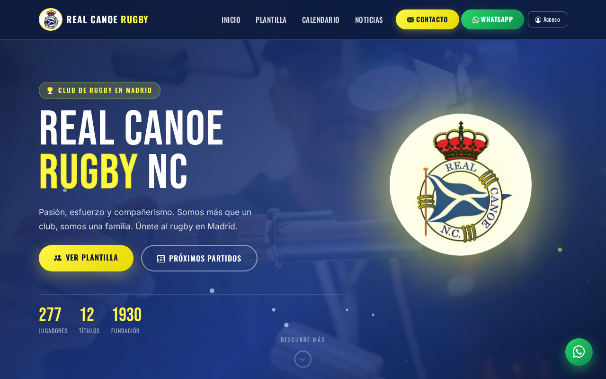

# 🛶 Real Canoe

> Full-stack club website for **Real Canoe N.C.** (Madrid) — news, match calendar, player roster and a built-in CMS, all backed by a REST API with role-based access control.

**🌐 Live demo: [realcanoe.vercel.app](https://realcanoe.vercel.app)**

<p align="center">
  
</p>

[](https://developer.mozilla.org/docs/Web/HTML)
[](https://developer.mozilla.org/docs/Web/CSS)
[](https://developer.mozilla.org/docs/Web/JavaScript)
[](https://nodejs.org/)
[](https://expressjs.com/)
[](https://www.mongodb.com/)
[](https://jwt.io/)
[](https://vercel.com/)

---

## Highlights

- **REST API** built with Express 5 — modular routes for news, matches, players, standings and contact
- **3-tier RBAC** (`user` → `admin` → `superadmin`) enforced server-side on every protected endpoint
- **In-browser CMS** — admins create, edit and delete content directly from the site, no code changes needed
- **Image uploads** with multer — player profile photos stored and served from the backend
- **JWT + bcrypt auth** — signed tokens, salted password hashes, secrets in environment variables only
- **Dynamic rugby standings** — bonus-point calculation following federation rules (offensive/defensive bonus)
- **Mobile-first UI** with Bootstrap 5 — readable on a phone at pitchside under direct sunlight

---

## Architecture

```
realcanoe/
├── api/
│   ├── middleware/     # verifyToken, checkRole
│   ├── models/         # User, News, Match, Player, Standings  (Mongoose)
│   └── routes/         # auth · news · matches · players · contact
├── js/
│   ├── model.js        # fetch calls to the API
│   ├── controller.js   # event handling and business logic
│   └── view.js         # DOM manipulation
├── css/
├── scripts/seed.js     # database seeder
├── index.js            # Express entry point
└── *.html              # pages: index · noticias · calendario · contacto · plantilla
```

**Frontend** follows a lightweight MVC pattern in vanilla JS — no build step, no framework.  
`model.js` fetches data, `controller.js` drives logic, `view.js` updates the DOM.

**Backend** is a stateless REST API. Every protected request carries a JWT in the `Authorization: Bearer` header. The `verifyToken` middleware validates the signature; `checkRole` gates the endpoint by role before any CRUD runs.

---

## Security

| Practice | Implementation |
|---|---|
| Password hashing | bcrypt with configurable salt rounds |
| Authentication | JWT signed with an environment-variable secret |
| Authorization | Per-endpoint RBAC middleware — least privilege |
| Input validation | Mongoose schema validation + route-level sanitization |
| Secrets | `.env` file — never committed to the repository |

---

## Stack

| Layer | Technology |
|---|---|
| Frontend | HTML5, CSS3, Vanilla JavaScript, Bootstrap 5 |
| Backend | Node.js, Express 5 |
| Database | MongoDB + Mongoose |
| Auth | JWT + bcrypt |
| Uploads | multer |
| Deployment | Vercel |

---

## Run locally

```bash
git clone https://github.com/Mariomin23/realcanoe.git
cd realcanoe
npm install
cp .env.example .env    # fill in MONGO_URI and JWT_SECRET
npm run seed            # optional: seed the database with sample data
npm run dev             # starts nodemon on http://localhost:3000
```

---

## Key decisions

**Vanilla JS over a framework.** The project didn't need client-side routing or a component model. Keeping it framework-free meant zero build tooling and a smaller learning surface — the focus stayed on API design and auth.

**RBAC as an architecture decision, not a feature.** Modelling roles in MongoDB and enforcing them through dedicated middleware meant authorization logic lives in one place and every new route inherits it automatically.

**Serverless on Vercel with Express.** Deploying a traditional Express server to a serverless environment forced me to understand the cold-start model and how to structure an app so it doesn't rely on in-memory state between requests.

---

## License

[MIT](LICENSE)
